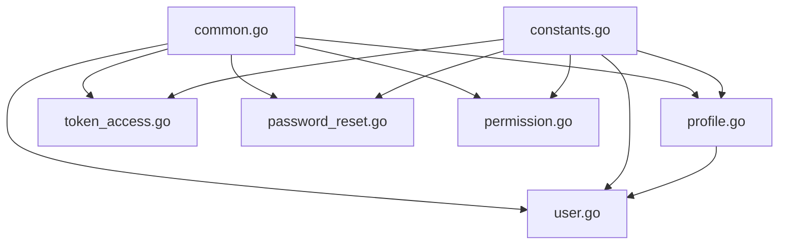

# Authentication Models - Entity Structure

Model package telah direfactor menjadi file-file entity yang terpisah untuk organisasi yang lebih baik dan maintainability yang lebih mudah.

## 📁 File Structure

```
model/
├── auth_models.go          # Documentation file (legacy placeholder)
├── common.go              # Shared types and utilities
├── constants.go           # Application constants
├── user.go               # User entity and related DTOs
├── profile.go            # Profile entity and related DTOs
├── token_access.go       # TokenAccess entity and related DTOs
├── password_reset.go     # PasswordReset entity and related DTOs
└── permission.go         # Permission entity and related DTOs
```

## 📋 Entity Files Overview

### 1. **common.go**
Shared utilities dan types yang digunakan di semua entities:
- `JSONB` type dengan `Value()` dan `Scan()` methods untuk PostgreSQL JSONB support

### 2. **constants.go**
Semua application constants:
- Token types: `TokenTypeAccess`, `TokenTypeRefresh`, `TokenTypeAPIKey`, `TokenTypeVerification`
- User status: `UserStatusActive`, `UserStatusInactive`, `UserStatusSuspended`, `UserStatusDeleted`
- Gender: `GenderMale`, `GenderFemale`, `GenderOther`, `GenderPreferNotToSay`
- Permissions: `PermissionAll`, `PermissionRead`, `PermissionWrite`, `PermissionDelete`, `PermissionAdmin`, `PermissionModerator`
- Roles: `RoleSuperAdmin`, `RoleAdmin`, `RoleModerator`, `RoleUser`, `RoleGuest`

### 3. **user.go**
User-related entities dan DTOs:
- `User` struct (authentication.users table)
- `UserWithProfile` struct untuk user dengan profile
- Request DTOs: `CreateUserRequest`, `UpdateUserRequest`, `LoginRequest`, `ChangePasswordRequest`
- Response DTOs: `LoginResponse`
- Helper methods: `IsActive()`, `IsLocked()`, `IsEmailVerified()`, `IsPhoneVerified()`

### 4. **profile.go**
Profile-related entities dan DTOs:
- `Profile` struct (authentication.profiles table)
- Request DTOs: `UpdateProfileRequest`
- Helper methods: `GetFullName()`

### 5. **token_access.go**
Token management entities dan DTOs:
- `TokenAccess` struct (authentication.token_access table)
- Request DTOs: `RefreshTokenRequest`
- Helper methods: `IsExpired()`, `IsValid()`

### 6. **password_reset.go**
Password reset entities dan DTOs:
- `PasswordReset` struct (authentication.password_resets table)
- Request DTOs: `ResetPasswordRequest`, `ConfirmResetPasswordRequest`
- Helper methods: `IsExpired()`, `IsBlocked()`, `IsValid()`

### 7. **permission.go**
Permission management entities dan DTOs:
- `Permission` struct (authentication.permissions table)
- `UserPermissionView` struct (v_user_permissions view)
- Request DTOs: `GrantPermissionRequest`
- Helper methods: `IsExpired()`, `IsValid()`

## 🔧 Usage Examples

### Import individual entities
```go
import "authcenterapi/model"

// Create user
user := &model.User{
    Username: "john_doe",
    Email:    "john@example.com",
    Status:   model.UserStatusActive,
}

// Check user status
if user.IsActive() {
    // User is active
}

// Create profile
profile := &model.Profile{
    UserID:    user.ID,
    FirstName: &[]string{"John"}[0],
    LastName:  &[]string{"Doe"}[0],
}

// Get full name
fullName := profile.GetFullName()
```

### Working with tokens
```go
// Create token
token := &model.TokenAccess{
    UserID:    user.ID,
    TokenType: model.TokenTypeAccess,
    ExpiresAt: time.Now().Add(time.Hour),
}

// Check token validity
if token.IsValid() {
    // Token is valid and not expired
}
```

### Permission management
```go
// Grant permission
permission := &model.Permission{
    UserID:     user.ID,
    Role:       model.RoleAdmin,
    Permission: model.PermissionAll,
}

// Check permission validity
if permission.IsValid() {
    // Permission is active and not expired
}
```

## ✅ Benefits of Separation

### 1. **Better Organization**
- Setiap table/entity memiliki file sendiri
- Easier navigation dan code management
- Reduced file size untuk better readability

### 2. **Maintainability**
- Changes pada satu entity tidak affect entity lain
- Easier to add new features per entity
- Better code isolation

### 3. **Team Development**
- Multiple developers bisa work pada different entities simultaneously
- Reduced merge conflicts
- Clear ownership per entity

### 4. **Testing**
- Unit tests bisa focused per entity
- Easier mocking dan testing individual components
- Better test organization

### 5. **Import Management**
- Hanya import dependencies yang diperlukan per file
- Reduced compilation time
- Better dependency management

## 🚀 Migration Guide

Jika sebelumnya menggunakan:
```go
import "authcenterapi/model"

// All types are still available
user := &model.User{}
profile := &model.Profile{}
token := &model.TokenAccess{}
// etc...
```

Setelah refactoring, semua types masih available dengan cara yang sama. Tidak ada breaking changes pada public API.

## 📝 Development Guidelines

### 1. **Adding New Fields**
- Tambahkan di entity file yang sesuai
- Update corresponding database schema
- Add helper methods jika diperlukan

### 2. **Adding New DTOs**
- Letakkan di entity file yang paling related
- Tambahkan validation tags jika diperlukan
- Document usage examples

### 3. **Adding New Constants**
- Tambahkan di `constants.go`
- Group dengan constants yang related
- Use consistent naming convention

### 4. **Adding Helper Methods**
- Tambahkan di entity file yang sesuai
- Follow existing naming patterns
- Add comprehensive comments

## 🔍 File Dependencies



- `common.go`: Base utilities (no dependencies)
- `constants.go`: Application constants (no dependencies)
- `user.go`: Depends on `common.go` dan `constants.go`
- `profile.go`: Depends on `common.go`, `constants.go`, dan `user.go` (untuk `UserWithProfile`)
- `token_access.go`: Depends on `common.go` dan `constants.go`
- `password_reset.go`: Depends on `common.go`
- `permission.go`: Depends on `common.go` dan `constants.go`

This structure provides clean separation while maintaining logical dependencies and usability.
